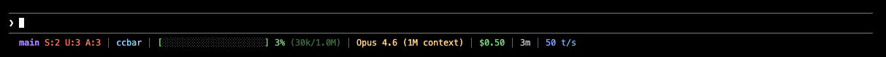

# ccbar

Lightweight, configurable Claude Code statusline with a color-coded context bar.




## Install

```bash
curl -sSfL https://raw.githubusercontent.com/dipenchovatiya/ccbar/main/install.sh | bash
```

That's it. Start a new Claude Code session to see the statusline.

## What You Get

| Widget | Color | What it shows |
|--------|-------|---------------|
| Git branch | Purple | Current branch name (truncated at 20 chars) |
| Git status | Salmon | Staged (S:n), unstaged (U:n), untracked (A:n) file counts |
| Git sync | Orange | Commits ahead (↑n) or behind (↓n) tracking branch |
| Worktree | Tan | Active worktree name (hidden when not in a worktree) |
| Folder | Cyan | Current working directory basename |
| Context bar | Blue / Gray | Visual fill bar showing context window usage |
| Context % | Green / Yellow / Red | Percentage used; color shifts at configurable thresholds |
| Token count | Dim | Used and total tokens (e.g. 44k/200k) |
| Model | Gold | Model name from session data |
| Cost | Green | Cumulative session cost in USD |
| Duration | Light gray | Total session wall-clock time |
| Speed | Light blue | Token throughput in tokens/second |

## Configuration

Config file: `~/.config/ccbar/config`

Created automatically on first install. Changes take effect on the next Claude Code turn — no restart needed.

**Disable widgets you don't want:**

```bash
SHOW_SPEED=false
SHOW_WORKTREE=false
SHOW_GIT_STATUS=false
```

**Adjust context threshold colors:**

```bash
THRESHOLD_MID=50    # green → yellow at 50% (default: 40)
THRESHOLD_HIGH=85   # yellow → red at 85% (default: 80)
```

**Change colors (ANSI 256 codes):**

```bash
COLOR_BRANCH=39     # bright blue instead of purple
COLOR_MODEL=208     # orange instead of gold
COLOR_COST=82       # brighter green
```

See [`config.default`](config.default) for all available options.
Color reference: [256colors.com](https://256colors.com)

## Uninstall

```bash
curl -sSfL https://raw.githubusercontent.com/dipenchovatiya/ccbar/main/install.sh | bash -s -- --uninstall
```

Your config at `~/.config/ccbar/config` is preserved. To remove it as well:

```bash
curl -sSfL https://raw.githubusercontent.com/dipenchovatiya/ccbar/main/install.sh | bash -s -- --uninstall --purge
```

## How It Works

ccbar is a bash script registered as Claude Code's `statusCommand`. On each turn, Claude Code pipes a JSON blob to stdin containing session data — context window usage, model, cost, duration, and token counts. ccbar parses it with `jq`, runs a pair of `git` commands against the current working directory, and writes a single ANSI-colored line to stdout.

## Performance

Typical render time is ~60ms. There is no Node.js, no npm, no daemon, and no background process — ccbar exits completely after each turn.

Benchmark it yourself:

```bash
echo '{"context_window":{"used_percentage":42,"context_window_size":200000,"total_input_tokens":80000,"total_output_tokens":4000},"model":"claude-sonnet-4-5","cost":{"total_cost_usd":0.12,"total_duration_ms":180000,"total_api_duration_ms":9000}}' \
  | time bash ~/.local/share/ccbar/ccbar.sh
```

## Requirements

| Requirement | Notes |
|-------------|-------|
| macOS or Linux | Tested on macOS 13+ and Ubuntu 22.04+ |
| bash 3.2+ | Ships with macOS; available everywhere on Linux |
| jq | `brew install jq` / `apt install jq` / `dnf install jq` |
| bc | Ships with macOS and most Linux distributions |
| git | Required for branch and status widgets |

## License

MIT
